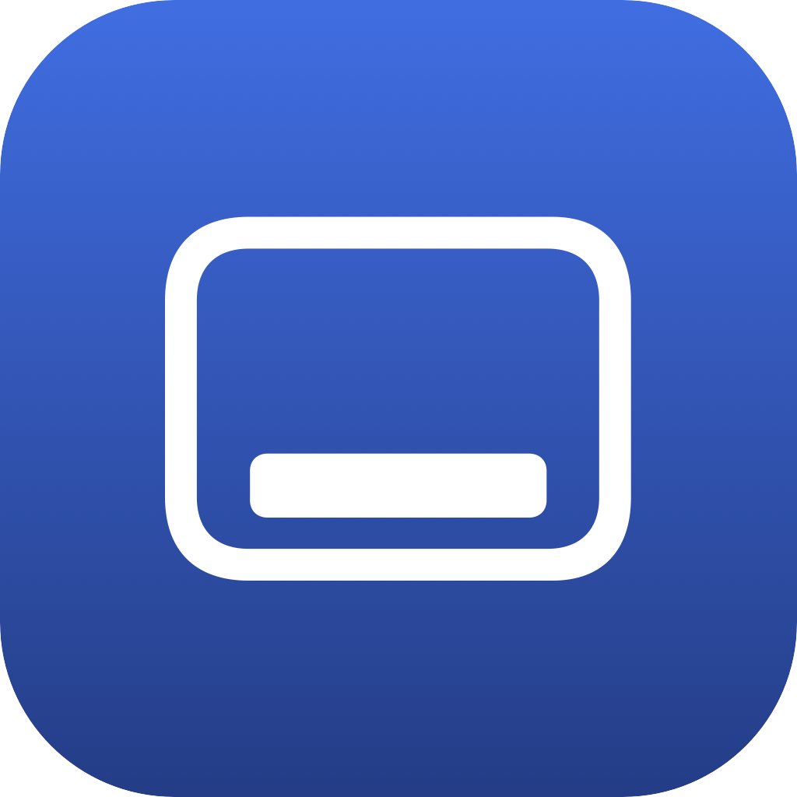

<p align="center">
  
</p>

<h1 align="center">WinDock</h1>

<p align="center"><b>Make your Mac Dock behave like the Windows taskbar.</b></p>

<p align="center">
  
  
  
</p>

---

Coming from Windows? On macOS, clicking an app's Dock icon does *not* minimize it when it's already active — and there's no built-in way to make it. WinDock fixes that.

> Click a Dock icon → the active app tucks away. Click it again → it comes back. Just like the Windows taskbar.

WinDock is a tiny, free menu-bar app. No window, no clutter — it just lives in your menu bar and makes the Dock feel the way you expect.

## Why WinDock?

macOS and Windows handle the taskbar/Dock differently, and the difference trips up almost everyone who switches:

| | Windows taskbar | macOS Dock (default) | macOS Dock **+ WinDock** |
|---|---|---|---|
| Click icon of active app | Minimizes it | Nothing happens | **Minimizes / hides it** ✅ |
| Click again | Restores it | Restores it | Restores it ✅ |
| Focus one app at a time | — | — | **Auto-hide the previous app** (optional) |

If you've ever clicked a Dock icon expecting the window to disappear — and nothing happened — WinDock is for you.

## Features

- **Click-to-toggle** — click the Dock icon of the frontmost app to tuck it away; click again to bring it back.
- **Hide or Minimize** — choose how apps tuck away:
  - **Hide** (default) — clean and instant; always restores reliably.
  - **Minimize** — windows slide into the Dock, Windows-taskbar style. *(Best with macOS "Minimize windows into application icon" enabled — WinDock offers to turn it on for you.)*
- **Single-app focus** *(optional)* — automatically hide the previous app when you switch, so only one app is on screen at a time. Multi-monitor aware: apps on other displays are left alone.
- **Multilingual** — UI in English, Korean, Japanese, and Chinese, auto-selected by your system language.
- **Lightweight** — a menu-bar-only app. No dock icon, no background bloat.

## Install

1. Download the latest `WinDock.app` from the [Releases](../../releases) page.
2. Move it to your **Applications** folder and open it.
3. Grant **Accessibility** permission when prompted:
   - System Settings → Privacy & Security → **Accessibility** → enable **WinDock**.
   - *(WinDock needs this to detect Dock clicks and hide/minimize apps. It does not record your screen or read your data.)*
4. The Dock icon appears in your menu bar. You're set.

To launch at login: System Settings → General → **Login Items** → add WinDock.

## Settings (menu-bar icon)

Click the menu-bar icon to configure:

- **Enable / Disable** — master switch.
- **Auto-hide previous app on switch** — single-app focus mode.
- **Hide on re-click of same app** — the core Windows-taskbar behavior.
- **Hide method: Minimize** — switch between Hide (⌘H style) and Minimize (into the Dock).

## How it works

WinDock uses two macOS APIs:

- **A global mouse monitor** to detect clicks on Dock icons (identified via Accessibility `AXApplicationDockItem`), so it can tell when you re-click the already-active app.
- **The Accessibility API** (`kAXHiddenAttribute` / `kAXMinimizedAttribute`) to hide or minimize apps.

No private APIs, no screen recording, no network access.

## Privacy

WinDock requires **Accessibility** permission only. It does not collect, transmit, or store any personal data. A debug log is written to `/tmp/windock.log` (auto-trimmed) and never leaves your machine.

## Contributing

Contributions are welcome — bug fixes, features, translations, docs.

```bash
# Local dev build (no certificate needed)
WINDOCK_SIGN="-" ./build.sh
open build/WinDock.app
```

See **[CONTRIBUTING.md](CONTRIBUTING.md)** for setup, project layout, and guidelines. Found a bug or have an idea? [Open an issue](../../issues).

When touching user-facing strings, please add all four languages (English, Korean, Japanese, Chinese).

## License

[MIT](LICENSE) © 2026 L2M Group Ltd.
